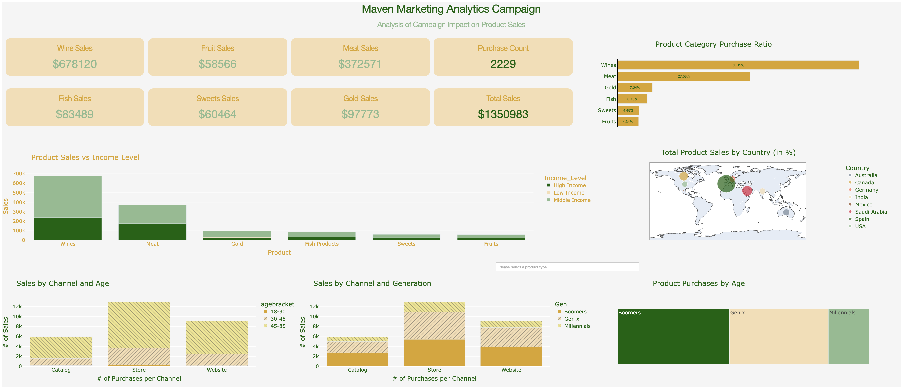

# Marketing and Product Analytics Dashboard

Marketing Analytics Campaign Analysis and Dashboard

Data Source: Maven Analytics (https://www.mavenanalytics.io/data-playground?search=marketing)

Objectives:
- Describe high level consumer behavior via dollars spent per product category, dollars spent overall, total number of purchases, and the ratio of purchases for each category.
- Show how income level impacts product category selection and purchases.
- Display ratio of total sales per country.
- Display how the campaign channel impacted sales from different generations and age groups.
- Show the number of purchases by generation for a given product category (dropdown for product category).
- Provide recommendations based on insights derived from the dashboard. 
